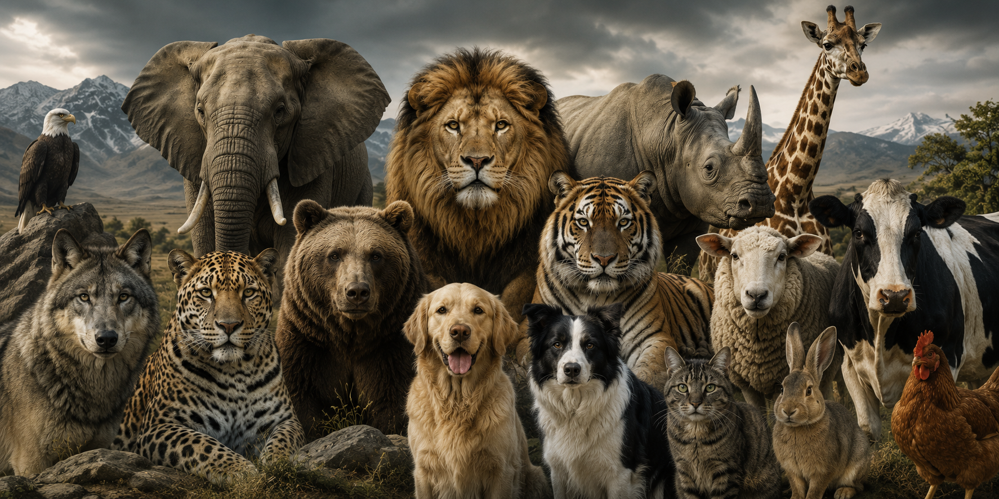

# Clasificación Multiclase de Animales a partir de Imágenes

<p align="center">
  
</p>

<p align="center">
  
  
  
  
  
</p>


---

## Descripción

Este proyecto aborda el problema de **clasificación multiclase de imágenes** utilizando el dataset **Animals with Attributes 2 (AwA2)**, que contiene más de 37,000 imágenes distribuidas en 50 clases de animales.

El objetivo es explorar, implementar y comparar múltiples enfoques de aprendizaje automático — desde modelos clásicos de Machine Learning hasta arquitecturas de Deep Learning y técnicas de aprendizaje no supervisado — para evaluar su rendimiento en un problema de alta complejidad.

## Objetivos

- Preprocesar y normalizar un dataset de imágenes para su uso en modelos de ML/DL
- Implementar y evaluar modelos clásicos: **Decision Tree**, **Random Forest** y **SVM**
- Diseñar y entrenar múltiples arquitecturas de **Redes Neuronales Densas (MLP)** con Keras
- Aplicar técnicas de **aprendizaje no supervisado**: PCA, K-Means y DBSCAN
- Comparar el rendimiento de todos los modelos y extraer conclusiones

## Estructura del Proyecto

```
 Clasificacion-Multiclase-de-Animales-a-partir-de-Imagenes/
├──  Proyecto_IA_.ipynb        # Notebook principal con todo el código
├──  README.md                  # Este archivo
└──  resultados/                # Gráficas generadas (se crean al ejecutar)
    ├── comparativa_svm_interna.png
    ├── grafica.png
    ├── demostracion_visual.png
    └── clustering_resultados.png
```

## Dataset

| Característica | Detalle |
|---|---|
| **Nombre** | Animals with Attributes 2 (AwA2) |
| **Fuente** | [Kaggle - rrebirrth/animals-with-attributes-2](https://www.kaggle.com/datasets/rrebirrth/animals-with-attributes-2) |
| **Imágenes totales** | 37,322 |
| **Muestra utilizada** | 5,000 (selección aleatoria con seed=42) |
| **Clases** | 50 especies de animales |
| **Preprocesamiento** | Escala de grises, 70×70 px, normalizado [0,1] |

### Ejemplos de clases incluidas:
`lion`, `dolphin`, `horse`, `elephant`, `hummingbird`, `ox`, `tiger`, `wolf`, `zebra`, `giraffe`, entre otras.

## Preprocesamiento

1. **Descarga automática** del dataset desde Kaggle usando `kagglehub`
2. **Muestreo aleatorio** de 5,000 imágenes (reproducible con `random.seed(42)`)
3. **Conversión a escala de grises** (1 canal de intensidad)
4. **Redimensionado** a 70×70 píxeles (4,900 features por imagen)
5. **Normalización** de valores de píxeles al rango [0, 1]
6. **Particionado** 80% entrenamiento / 20% prueba con shuffle

## Análisis Exploratorio

Se realizaron las siguientes visualizaciones estadísticas:

- **Histograma de intensidades** de píxeles del dataset completo
- **Imagen promedio** (calculada píxel a píxel sobre 100 imágenes)
- **Imagen de desviación estándar** (variabilidad entre imágenes)
- **Distribución de promedios** e intensidades por imagen

## Modelos Implementados

### Parte 1: Machine Learning Clásico

| Modelo | Accuracy |
|---|---|
| Decision Tree | 5.50% |
| Random Forest | **8.90%** |
| SVM (kernel lineal) | 7.00% |
| SVM (kernel polinomial) | 7.30% |
| SVM (kernel RBF) | **10.20%** |

### Parte 2: Deep Learning (MLP con Keras)

| Arquitectura | Capas | Accuracy |
|---|---|---|
| Arq1 | Dense(64) → Dense(128) → Dense(128) | 5.30% |
| Arq2 | Dense(64) → Dense(64) → Dense(128) → Dense(128) → Dense(256) → Dense(256) | **8.80%** |
| Arq3 | 10 × Dense(128) | 7.00% |

> **Configuración:** Optimizador Adam, loss: sparse_categorical_crossentropy, 50 épocas, activación ReLU

### Parte 3: Aprendizaje No Supervisado

| Técnica | Resultado |
|---|---|
| **PCA** (2 componentes) | 36.32% varianza explicada (CP1: 23.71%, CP2: 12.61%) |
| **K-Means** (k=50) | Silhouette Score: 0.3219 |
| **DBSCAN** (eps=0.3, min_samples=10) | 36 clusters, Silhouette Score: 0.5493, 89.6% ruido |

## Resultados

### Comparativa General de Modelos

```
SVM (RBF)     ████████████████████  10.20%  Mejor modelo
Random Forest ██████████████████    8.90%
DL Arq2       █████████████████     8.80%
SVM (poly)    ██████████████        7.30%
DL Arq3       ██████████████        7.00%
SVM (linear)  ██████████████        7.00%
Decision Tree ███████████           5.50%
DL Arq1       ██████████            5.30%
```

### Hallazgos Clave

- El **SVM con kernel RBF** fue el mejor modelo global (10.20%)
- Los modelos clásicos compitieron de cerca con las redes neuronales densas
- **DBSCAN** obtuvo mejor Silhouette Score (0.5493) que K-Means (0.3219), pero a costa de clasificar el 89.6% como ruido
- PCA con solo 2 componentes captura el 36.32% de la varianza total

## Cómo Ejecutar

### Opción 1: Google Colab (Recomendado)
1. Abre el archivo `Proyecto_IA_.ipynb` en Google Colab
2. Ejecuta todas las celdas secuencialmente
3. El dataset se descarga automáticamente desde Kaggle

### Opción 2: Local
```bash
# Clonar el repositorio
git clone https://github.com/Afav22-lab/Clasificacion-Multiclase-de-Animales-a-partir-de-Imagenes.git
cd Clasificacion-Multiclase-de-Animales-a-partir-de-Imagenes

# Instalar dependencias
pip install numpy pandas matplotlib pillow scikit-learn tensorflow kagglehub tqdm

# Abrir el notebook
jupyter notebook Proyecto_IA_.ipynb
```

### Dependencias principales
```
numpy
pandas
matplotlib
Pillow
scikit-learn
tensorflow >= 2.0
kagglehub
tqdm
```

## Conclusiones

1. **La clasificación multiclase con 50 clases es un problema complejo** que requiere representaciones más sofisticadas que los píxeles en bruto en escala de grises.

2. **SVM con kernel RBF fue el mejor modelo** (10.20%), superando incluso a las redes neuronales densas, demostrando que para datos de alta dimensionalidad con representaciones simples, los modelos basados en kernel pueden ser competitivos.

3. **Las redes MLP no son ideales para visión por computadora**. Arquitecturas convolucionales (CNN) o modelos preentrenados (Transfer Learning) serían significativamente más efectivas.

4. **El análisis no supervisado reveló** que las imágenes de animales en escala de grises forman clusters con solapamiento considerable, lo que explica la dificultad de clasificación.


## Tecnologías Utilizadas

<p align="center">
  
  
  
  
  
  
  
  
  
</p>

## Recursos

- **Video Presentación:** [https://youtu.be/91J58u7M-MQ](https://youtu.be/91J58u7M-MQ)
- **Notebook en Google Colab:** [https://colab.research.google.com/drive/1INuWJYF70w4ftXeVLmetnab6NKbJi96M?usp=sharing](https://colab.research.google.com/drive/1INuWJYF70w4ftXeVLmetnab6NKbJi96M?usp=sharing)

## Autores

- **Andrés Felipe Alfonso Viviescas** — [GitHub](https://github.com/Afav22-lab)


<p align="center">
  <strong>Universidad Industrial de Santander (UIS) — 2026</strong>
</p>
